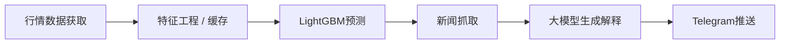

### 项目地址

- GitHub: [llm_stock_report](https://github.com/miaohancheng/llm_stock_report)

这个项目是我最近做的一个个人开源项目，目标不是做一个“只会聊天的股票助手”，而是做一个真正能每天看盘、给出结构化结论、还能自动推送到 Telegram 的看盘机器人。

它的核心思路很明确：

- **大模型负责解释和归纳；**
- **传统量化模型负责给出相对客观的预测信号；**
- **两者结合，而不是互相替代。**

### 这个项目解决什么问题

如果只用大模型来分析股票，通常会遇到几个问题：

1. 模型很会“说”，但不一定真的有稳定的数值判断能力；
2. 对价格、技术指标、样本窗口的处理不够严格；
3. 容易被当天新闻和叙事带偏；
4. 输出看起来很完整，但缺少稳定的可重复预测逻辑。

如果只用传统量化模型，也有另外一组问题：

1. 预测分数虽然客观，但对人不够友好；
2. 很难把新闻、事件和市场叙事自然串起来；
3. 最终输出往往只是因子、分数和表格，不够适合日常看盘。

所以这个项目最后选的方向，不是“LLM 替代量化”，也不是“量化完全不需要 LLM”，而是做一个双引擎系统。

### 项目整体架构

从当前仓库结构来看，这个项目已经是一个完整分层的 Python 工程，不是单文件脚本。

大致可以拆成几层：

- `app/data/`：按市场抓取行情数据，A 股走 `AKShare`，美股和港股走 `yfinance`
- `app/features/`：构建技术指标等特征
- `app/model/`：做 Qlib 风格数据整理、训练和预测
- `app/news/`：聚合新闻搜索，主路径是 Tavily，Brave 做 fallback
- `app/llm/`：适配 OpenAI / Gemini / Ollama，并生成解释文本
- `app/report/`：把预测结果和分析结论渲染成 Markdown 和 Telegram 消息
- `app/jobs/`：训练和日报的统一入口

README 里也给出了很清晰的处理链路：



### 使用说明

这部分按项目当前 README 的方式来，用起来是比较直接的。

#### 1. 安装依赖

项目要求 Python `3.11+`。

先安装基础依赖：

```bash
python -m pip install --upgrade pip
python -m pip install -e '.[dev]'
```

如果你还需要完整的 `pyqlib` 环境，可以继续安装：

```bash
python -m pip install -e '.[qlib]'
```

从 `pyproject.toml` 看，核心依赖包括：

- `akshare`
- `lightgbm`
- `numpy`
- `pandas`
- `PyYAML`
- `requests`
- `yfinance`

#### 2. 配置股票池

股票池配置在：

- `config/universe.yaml`

可以按市场分别维护 A 股、美股和港股的股票列表。

#### 3. 配置环境变量

把：

- `.env.example`

复制成：

- `.env`

然后把需要的 key 填进去。

根据 README，目前至少需要：

- `TAVILY_API_KEY`
- `BRAVE_API_KEY`
- `TELEGRAM_BOT_TOKEN`
- `TELEGRAM_CHAT_ID`

模型侧至少配置一条可用路径：

- `LLM_PROVIDER=openai` + `OPENAI_API_KEY`
- `LLM_PROVIDER=gemini` + `GEMINI_API_KEY`
- `LLM_PROVIDER=ollama` + `OLLAMA_BASE_URL` + `OLLAMA_MODEL`

#### 4. 先跑测试

```bash
python -m pytest
```

这个步骤很值得保留，因为项目里已经有比较完整的测试目录。先把环境和基础链路验证掉，后面排查问题会省很多时间。

#### 5. 手动训练模型

日报依赖训练好的模型，所以可以先按市场手动训练。

```bash
python -m app.jobs.run_retrain --market cn --date 2026-03-04
python -m app.jobs.run_retrain --market us --date 2026-03-04
python -m app.jobs.run_retrain --market hk --date 2026-03-04
```

从实现上看，训练入口会做几件事：

- 读取股票池；
- 获取或补齐每只股票的历史数据；
- 构建 Qlib 风格的训练特征；
- 调用 `LightGBM` 训练回归模型；
- 如果 LightGBM 不可用，或者股票池太小，则退化到线性 fallback 模型；
- 最后把模型工件保存下来。

这里有一个我比较喜欢的设计：项目不是假设“树模型一定训练成功”，而是明确实现了 fallback 路径。这对自动化日报项目很重要，因为它强调的是每天都能稳定跑，而不是只在理想环境下跑。

#### 6. 生成日报

训练完成之后，就可以手动跑日报。

```bash
python -m app.jobs.run_report --market cn --date 2026-03-04
python -m app.jobs.run_report --market us --date 2026-03-04
python -m app.jobs.run_report --market hk --date 2026-03-04
```

日报任务会完成下面这些动作：

- 加载股票池；
- 获取或更新历史行情；
- 生成预测特征；
- 加载最新可用模型；
- 生成分数、排名和多空 bucket；
- 搜索相关新闻；
- 调用大模型生成个股解释和市场复盘；
- 输出 Markdown / CSV / 元数据；
- 最后按配置推送到 Telegram。

#### 7. 输出目录

项目默认会把运行结果写到：

```text
outputs/{market}/{date}/
```

README 里列出的主要输出文件有：

- `summary.md`
- `details.md`
- `predictions.csv`
- `run_meta.json`

这组输出设计是比较实用的，因为它同时兼顾了：

- 给人读的报告；
- 给程序分析的结构化结果；
- 以及后续排查和追踪所需的运行元信息。

### 为什么不能只靠大模型预测股票

这是这个项目最核心的开发思考。

如果把问题简化成一句话，那就是：

- **股票预测是一个需要结构化历史信息、统计约束和风险边界的问题，而不是一个只靠语言理解就能解决的问题。**

大模型擅长的部分是：

- 吸收新闻；
- 理解事件语义；
- 把复杂信息组织成人类可读的结论；
- 给出解释、风险提示和摘要。

但大模型不擅长直接代替一个严格的时序预测器。尤其是涉及：

- 技术指标；
- 滚动窗口；
- 下一交易日收益标签；
- 不同市场的历史行情比较；
- 排名和 bucket 划分。

这些内容如果完全交给 LLM，输出通常会变得很主观，也不够稳定。

### 为什么要加 Qlib 风格特征和树模型

这个项目采用的方式，本质上是先把“预测”这部分交给更传统的量化路径，再让大模型去做解释和报告。

从实现上看：

- `app/model/qlib_data_builder.py` 负责构造 Qlib 风格的数据框架；
- `app/features/technical.py` 负责技术指标；
- `app/model/trainer.py` 默认用 `LightGBM` 来训练 `next_day_return` 的回归模型；
- `app/model/predictor.py` 负责根据预测值做标准化、排序和 side bucket 划分。

这里选择树模型而不是把所有判断都交给 LLM，原因很直接：

1. 树模型更适合吃结构化数值特征；
2. 对下一交易日收益这种目标，至少能提供相对客观的排序信号；
3. 可以把“解释”和“预测”这两个职责拆开；
4. 工程上更容易自动化，也更容易做 fallback。

换句话说，大模型在这个项目里不是“预测器本身”，而是：

- **解释器**
- **摘要器**
- **风险提示器**
- **交互层**

这也是我觉得这个项目更合理的地方。

### 最终目标为什么是一个看盘机器人

如果只是做一个模型实验，其实到 `predictions.csv` 就可以停了。

但这个项目最后多做了一步，就是把整个链路封成一个可以日常使用的机器人：

- 自动抓数据；
- 自动训练；
- 自动找新闻；
- 自动写总结；
- 自动推送 Telegram。

这一步非常关键，因为它把项目从“一个研究脚本”推进成了“一个真实可用的系统”。

对个人用户来说，这类看盘机器人最大的价值不是替你自动交易，而是每天帮你完成：

- 初筛；
- 排序；
- 新闻归纳；
- 风险提醒；
- 日终复盘。

这会大幅减少每天看盘时的信息整理成本。

### 我比较认可的几个工程点

从现在这个仓库看，有几个设计我觉得是对的：

#### 1. 多市场统一框架

不是只做单一市场，而是同时覆盖：

- CN
- US
- HK

这让系统的扩展性更强，也更贴近真实使用需求。

#### 2. 数据抓取有缓存和补齐

项目没有每次都全量重拉，而是做了本地历史缓存和增量更新。这对行情类系统很重要，不然跑久了之后成本和稳定性都会变差。

#### 3. 新闻检索有主备路径

Tavily 主搜索、Brave 兜底，这种 fallback 思路跟模型层的 fallback 一样，体现的是系统稳定性优先。

#### 4. 大模型只是最后一层

这点是我最认同的：LLM 在这个项目里是最后一层表达，而不是最底层预测内核。

### 后续还可以怎么继续做

如果继续往下做，我觉得还可以继续增强几个方向：

- 增加更明确的回测指标和验证报告；
- 引入更丰富的因子集合，而不只是技术指标；
- 给 Telegram 推送增加更强的交互能力；
- 把 GitHub Pages 上的案例页做得更像一个轻量研究面板。
